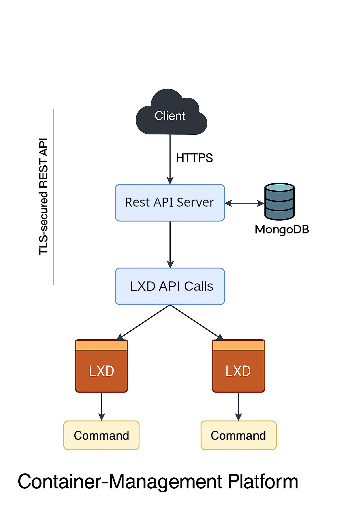
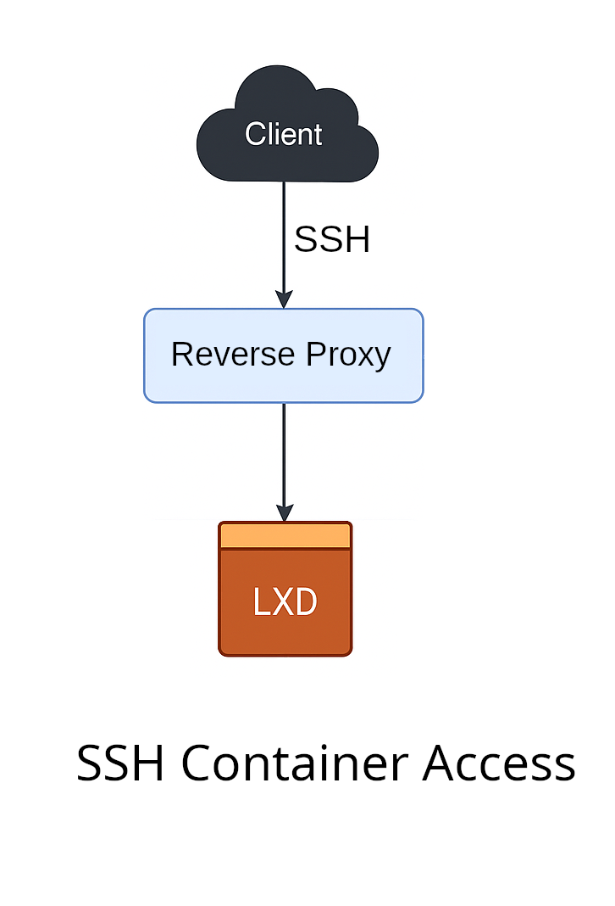

# 🐧 Linux Virtualization RestAPI Server and Front-End App

> **A super-lightweight LXD/Incus container management GUI for Linux systems**  
> Current Distro: **🟣 Ubuntu 24.04**

##Overview

### Purpose of the Project
Incus is a strong manager for system containers and VMs. However, this is basically TUI app and every tasks should be interacted by shell.
Then, we can assume a situation:
    A. The Developer wants to generate some clean-build environment for testing web apps.
    B. The Developer is on a subway as he/she is out for business.
    C. The task is not too complex to use some miscellanous tools.
Now, it is almost impossible to prepare some build enviroment on a subway.
The developer have no place to lay his laptop.
But, if the developer has some management app for Incus Cluster,  he/she can easily setup this basic environment.
I wanted to manage Incus containers easily, and I can get new Linux Containers on a subway.
And, after I arrived to a college, I could easily test a shell scripts of a project.

Abstract agenda of this project is, to make incus easily accessible to non-developers.


### RestAPI Structure



This project manages LXD Containers by calling API binding from Go.
- Basic requests are handled by RestAPI endpoint, and distinguished by container tag.
- Three ports are allocated for each containers.
- First port is allocated as OpenBSD Secure Shell(SSH).
*Spare two ports are left as empty spaces; as user may use other service. (e.g: MySQL, XRDP)*

### Secure Shell Reverse Proxy


- Secure Shell is managed by Nginx Reverse proxy.
- Once a container boots up, Proxy configuration file is automatically modified.

---

## 🚀 Getting Started – Server Setup
# 📦 Container State Change API

These endpoints allow changing the state of a container instance managed by the virtualization unit.

## Available Endpoints for Status Change
Endpoints other than status change(e.g: /delete, /create, /request) are described in Swagger docs.
Please see https://yourserverdomain:32000/swagger/index.html
"
| Method | Endpoint     | Description               |
|--------|--------------|---------------------------|
| POST   | `/start`     | Start a container         |
| POST   | `/pause`     | Pause a running container |
| POST   | `/resume`    | Resume a paused container |
| POST   | `/restart`   | Restart a container       |

## Request Body

All endpoints require a plain text` body with the container tag.

```text
  container-name
```

- `tag` (string, required): The unique identifier (name or tag) of the container you want to target.

## Responses

| Code | Meaning                      |
|------|------------------------------|
| 200  | State changed successfully   |
| 400  | Bad request (e.g. missing tag) |
| 500  | Internal server error        |

## Example Curl

```bash
curl -X POST http://<host>:<port>/start \
  -d 'my-container'
```

### 📦 Installation Steps

1. **Clone this repository**
   ```bash
   git clone https://your-repo-url
   cd your-repo-name
   ```

2. **Run installation commands**
   ```bash
   make
   ./initial_setup.sh --reconfigure-incus
   systemctl start --now linuxVirtualization
   ```

   > ⚠️ **WARNING:**  
   > This process **overwrites your Nginx configuration**.  
   > Be sure to modify `nginx.conf` from this repo before running the setup script.

3. **After setup**
   - Default SSH & Spare ports(ssh port + 1, ssh port + 2) will be assigned automatically.
   - Incus containers' port connection will be managed via a reverse-proxy (Nginx).

---

## 🖥 GUI Application Usage

### ✅ Quick Steps

1. **Navigate to the application directory**
   ```bash
   cd app
   ```

2. **Run the GUI application**
   ```bash
   python3 main.py
   ```

3. **Login with default credentials**
   - **Username:** *username from Front-end app*
   - **Password:** *password from Front-end app*  
     > ⚠️ Change this password immediately after your first login!

---

## 🧠 Back-End Information

- Written in **Go**, optimized for Linux server orchestration.
- All container operations (create, stop, start, etc.) are securely managed via the back-end.

### 🔧 Build the back-end binary

```bash
make
```

---

## 🧱 Virtual Machine Management

- Powered by **LXD/Incus containers**
- Integrated with Nginx reverse-proxy (experimental!)
- Containers are isolated, and each is assigned its own port.

> ⚠️ **Note:** Reverse proxy logic is still under active development. You may experience unstable behavior when using multiple container ports simultaneously.

---

## 📁 Directory Structure Overview

```text
linuxVirtualization/
├── app
│   ├── bin
│   │   ├── lvirtfront-0.1-arm64-v8a_armeabi-v7a-debug.apk #app builds
│   │   └── lvirtfront-0.1-arm64-v8a_armeabi-v7a-release.aab
│   ├── buildozer.spec #buildozer config file
│   ├── certs
│   │   └── ca.crt # client cert (auto-generated)
│   ├── icon.png
│   ├── main.py # kivy client 
│   ├── README.md
│   └── requirements.txt
├── ca.srl
├── certs # server certs (auto-generated)
│   ├── server.crt
│   └── server.key
├── conSSH.sh # ssh initialization script
├── container
│   └── latest_access
├── docs # swagger docs
│   ├── docs.go
│   ├── swagger.json
│   └── swagger.yaml
├── drop_all.props # force drop all mongo props
├── go.mod 
├── go.sum
├── initial_setup.sh # initial setup script
├── install_svc.sh # install daemon service script
├── killall.sh # force delete all informations
├── kill_for_reload.sh 
├── kill.sh # systemctl stop command
├── linuxVirtualizationServer # go compiled binary
├── linuxVirtualization.service # daemon service file
├── linux_virt_unit
│   ├── crypto
│   │   └── crypto.go # encryption logics
│   ├── go.mod
│   ├── go.sum
│   ├── http_request
│   │   └── http_request.go # RestAPI Endpoints
│   ├── incus_unit
│   │   ├── base_images.go # auto-generated base image fingerprints
│   │   ├── change_container_status.go # state change logic
│   │   ├── create_containers.go # container creation logic
│   │   ├── get_info.go # get miscellanous informations
│   │   ├── handle_container_state_change.go # handle state change endpoints
│   │   ├── handle_user_info.go # securely handle user auth
│   │   └── worker_pool.go # multi-processing worker pool
│   ├── linux_virt_unit.go # shared structure definitions
│   ├── mongo_connect
│   │   └── mongo_connect.go # mongoDB client initialization
│   └── README.md
├── main.go # main function of this server
├── Makefile
├── mongo.props # create specified mongoDB admin user
├── nginx.conf  # default nginx configuration (if you have pre-configured Nginx config, place here
├── openssl.cnf # openssl configuration for self-signing
├── README.md
├── remove-service.sh # daemon service uninstallation
├── server_reload.sh  # systemctl restart 
├── server.sh # execute server as nohup
└── utils
    ├── keygen.sh # generate self-signed certificate
    ├── make_base_images.sh # create base image
    ├── make_incus_units.sh # create base_images.go
    └── management_tools.sh # bash alias for convenient management
```

## 🧩 Architecture
```
[Client (KivyMD)] ⇄ [REST API (Go)] ⇄ [linux_virt_unit] ⇄ [Incus API]
                                       ⇅
                                   [MongoDB]
```

---

## 📜 TODO
- Support for other distributions
- Incus integration for RestAPI /create path

## 📜 NOTE
- Default domain is hobbies.yoonjin2.kr.
- If you are installing this, please change URL prefix.
- You can find prefixes by this command.
```bash
grep yoonjin2 $(find . -type f)
```
 
---

## 🤝 Contributing

Pull requests are welcome! If you find any issues or have improvements, feel free to open a PR or issue.

---

## 📜 License

This project is licensed under the MIT License. See the `LICENSE` file for details.
